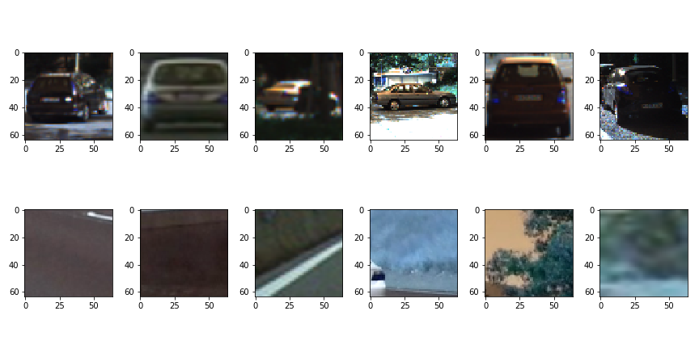
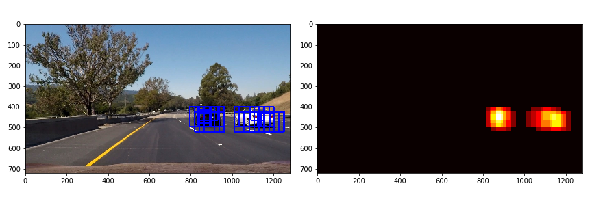

## Vehicle Detection Project

### Overview

The goal of this project is to detect vehicles from video images using HOG-SVM technique. Following illustrates the steps implemented in this project:

* Perform a Histogram of Oriented Gradients (HOG) feature extraction on a labeled training set of images. 
* Apply a color transform and append binned color features, as well as histograms of color, to HOG feature vector. 
* Train a Linear SVM classifier on the training set of images.
* Implement a sliding-window technique and use the trained classifier to search for vehicles in images.
* Run processing pipeline on a video stream and create a heat map of recurring detections frame by frame to reject outliers and follow detected vehicles.
* Estimate a bounding box for vehicles detected and draw the box on the images.

### Feature Selection

To capture the color and shape of car objects in a image, we use three feature set: spatial binning, histogram and HOG.

#### **Color Space**

To determine which color space can provide better features to identify a vehicle object, I randomly select 1000 images separately from traing car/not-car images, and plot their historgram for each channels in different color spaces (RGB, HLS, HSV, and YCbCr). Following images show the result:

**RGB color space histogram**

**HLS color space histogram**

**HSV color space histogram**

**HSV color space histogram**

**YCrCb color space histogram**

Compare to other color spaces, the YCrCb color space has a more compact structure. We can see that it is easier to classify the vehicle and not-vehicle from Cr and Cb channels based on their histogram. In the following section, we also check the HOG feature in different color spaces to determine which color space could be a better choice.

#### **Histogram of Oriented Gradients (HOG)**

To find out which color space is prefered for HOG feature, we use **`skimage.hog()`** and HOG parameters of `orientations=9`, `pixels_per_cell=(8, 8)` and `cells_per_block=(2, 2)`to show the hog images of a random car image.

**RGB Hog feature images**

**HLS Hog feature images**

**HSV Hog feature images**

**YCrCb Hog feature images**

Visually we can see there are less overlop in all three channels' Hog images in YCrCb and RGB color space. Combine what we find in color histogram plots, YCrCb seems to be a prefer color space to use. Testing the classifier with different color spaces also confirms we get best result from YCrCb color space.

The code for HOG feature extraction is implemented in function `get_hog_features` in `utils.py` file.

### Feature parameters

To determination the best feature parameters, I trained the classifier on various parameter combinations. Following table lists the parameter options I have tested and the final parameters we choose for this project based on the trade-off of accuarcy and running time:

Spatial Bining Dimemsions | Histogram Bin Number | HOG Orient | HOG Pixel per Cell | HOG Cells per Block
--------------------------| -------------------- | ---------- | ------------------ | ------------------- 
(16, 16) (32, 32) | 16, 32 | 8, 9, 12, 16 | 8, 9, 12, 16 | 2, 4 

The parameters we use in our final submission are (see **`main.py`**):

* Spatial Bining Dimensions `spatial_size=(32, 32)`
* Histogram Bin Number: `hist_bins = 32`
* HOG parameters:
	1. `orient=9`
	2. `pix_per_cell = 8`
	3. `cell_per_block = 2`
	

## SVM Classifier

I choose to use linear SVM classifier for vehicle tracking due to the concern of speed. While RBF SVM gives higer classification accuracy, it runs much slower. Linear SVM provides reasonable trade-off of accuracy and speed.

To find the best hyper-parameter for SVM classifier, I test the classifier with different C values `(0.1, 0.5, 0.8, 1.0, 1.2)`. The optimized C value from our testing is `C=0.1`. Not only it gives good accuarcy, the SVM classifier with `C=0.1` results less false positive detection. The SVM classifier is implemented in function `train_features` in **`main.py`**. The validation accuarcy of our final classifier is 0.991.

We train the classifier using the dataset provided from KITTI and GTI. Following shows some sample images from the dataset.

### Sliding Window Search

The sliding window search algorithm convolves a small window to extract image patches for classifer to identify if it is a vehicle. The size of window and overlap between two consecutive windows are parameters need to be optimized.

At the beginning I used single scale window and tested with different overlap from 0.6 - 0.85 to find the best overlap. Then I tried to improve the result by multiple scale windows (2 - 3 windows with size of 32, 64, 96, 128) in search. I found the window size `(96, 96)` with 0.75 overlap gives best result so far for a single window search. Ultimately  I use two scales search with following parameters:

* Window size `(64, 64)` and `(96, 96)`
* Overlap `(0.75, 0.75)`
* `xy_start_stop = (400, 656)`

Following image shows the locations of a search windows (window size (96, 96)):

Following shows sample resulting images from window search:

The sliding window search is implemented in function `detect_cars` in **`main.py`**

### Video Implementation

#### False Positives Filter and Method for Combining Overlapping Bounding Boxes.

Here is the steps I used to handle false positives and multiple overlapping bounding boxes:

* Recorded the positions of positive detections in each frame of the video
* From the positive detections I created a heatmap.
* Combine the last **20** frames of heapmap and threaholded the map (>16) to identify vehicle positions.
* Used `scripy.ndimage.measurements.label()` to identify individual blobs in the heatmap.
* Assume each blob corresponded to a vehicle and constructed bounding boxes to cover the area of each blob detected.

Following show the example of images and their comressponding heatmaps:

Here is the output of `scipy.ndimage.measurements.label()` on the integrated heatmap:

Following shows the resulting bounding boxes are drawn onto the last two images:

Here is a [link](https://youtu.be/VwN4QoCyFlQ) to my final video output:

    

###Discussion

The HOG-SVM technique impelmented in this project works resonable well on detecting vehicles in our test videos. One major issue of this technique is the performance. It takes more then 3 seconds to handle one frame. This is obviously not suitable for real-time application. Another issue related to our implementation is it some times fails to detect vehicle that becomes far away. Following lists some approaches I think can be tried to enhance the performance:

* Use smaller feature set. The number of features is 8460, it can be resuce to smaller number using smaller spatial bining size, histogram bins or HOG parameters.
* HOG feature calculation consume a lot of CPU. One way to reduce HOG CPU consumption is to use single scale sliding window. Choose appropriate sliding window scale may also help to detect vehicle driving far away, which it some times fails to detect in current impelmentation.
* Optimize HOG feature calculation to improve the performance. Currently I use sklearn's HOG implementation, other implemenation may provide better performance.

Also, there are many deep learning approaches for vehicle detection and tracking available now. I'll try those deep learning method in the future to find a optimal solution.

